# 2C2N
## Description
2C2N is a C-based framework, inspired by PyTorch, for building and running Convolutional Neural Networks (CNNs). It features implementations of commonly used CNN layers such as convolutional, pooling, and dense (or fully connected) layers, along with its related forwarding and back-propagation procedures. The framework also includes well-known computation functions and data structures like matrix2d/3d for efficient matrix operations. The code has been developed in order to provide an easy, intuitive and modular interface with a low footprint memory usage.

### Test
2 tests are available in test/ folder:
- test_common
- test_layer

### Tools
Several tools are available in tools/ folder:
- build.sh: build all targets (CMake)
- clear.sh: remove the build folder
- test.sh: run tests in verbose mode (CTest)
- format.sh: code formatting (Clang Format)
- heap-check.sh: run memory leaks check over tests (Valgrind)

https://drive.google.com/file/d/1eEKzfmEu6WKdRlohBQiqi3PhW_uIVJVP/view

## Matrix
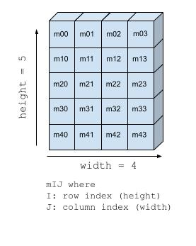
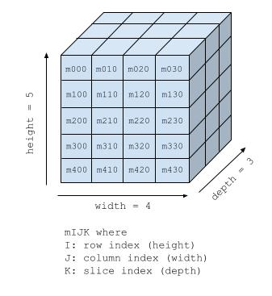

The framework is built around 2 main structures: *matrix2d_t* and *matrix3d_t*, defined as follows:
```c
typedef struct {
  int height;
  int width;
  float *values;
  bool loaded;
} matrix2d_t;

typedef struct {
  int height;
  int width;
  int depth;
  float *values;
  bool loaded;
} matrix3d_t;

```
A matrix can be created as follows:
```c
/* initialize a matrix, and allocate dynamically the *values pointer */
void matrix2d_init(matrix2d_t *m, int height, int width);
void matrix3d_init(matrix2d_t *m, int height, int width);

/* initialize a matrix, and set the *values pointer to a valid base_address */
void matrix2d_load(matrix2d_t *m, int height, int width,
                   float *const base_address);
void matrix3d_load(matrix2d_t *m, int height, int width,
                   int depth, float *const base_address);
```
and can be destroyed as follows:
```c
/* destroy a matrix (frees the *values pointer, has no effect if the
matrix has beeninitialized with matrix2d_load(...))
*/
void matrix2d_destroy(const matrix2d_t *m);
void matrix3d_destroy(const matrix3d_t *m);
```

The content of the matrix is stored inside a flattened 1D array, but the interface is built
to get the user be able to manipulate the matrix in a *math_like* fashion:

```c
/* get a non-mutable reference to a cell of the matrix */
const float *matrix2d_get_elem_as_ref(const matrix2d_t *const m, int row_idx,
                                      int col_idx);
const float *matrix3d_get_elem_as_ref(const matrix3d_t *const m, int row_idx,
                                      int col_idx, int z_idx);

/* get a mutable reference to a cell of the matrix */
float *matrix3d_get_elem_as_mut_ref(const matrix3d_t *const m, int row_idx,
                                    int col_idx, int z_idx);
float *matrix2d_get_elem_as_mut_ref(const matrix2d_t *const m, int row_idx,
                                    int col_idx);

/* get the value of a cell of the matrix */
float matrix2d_get_elem(const matrix2d_t *const m, int row_idx, int col_idx);
float matrix3d_get_elem(const matrix3d_t *const m, int row_idx, int col_idx,
                        int z_idx);

/* set the value of a cell of the matrix */
void matrix2d_set_elem(const matrix2d_t *const m, int row_idx, int col_idx,
                       float value);
void matrix3d_set_elem(const matrix3d_t *const m, int row_idx, int col_idx,
                       int z_idx, float value);

/* get a slice of 3D matrix as a 2D matrix */
void matrix3d_get_slice_as_mut_ref(const matrix3d_t *m, matrix2d_t *result,
                                   int z_idx);

```

Furthermore, the framework expose a bunch of useful functions for matrix operations:
```c
// copy the content of *values* of the input matrix inside the output matriux
void matrix3d_copy_content(const matrix3d_t *const input,
                           const matrix3d_t *output);
void matrix2d_copy_content(const matrix2d_t *const input,
                           const matrix2d_t *output);

// randomize the content of *values* with floats between 0 and 1
void matrix2d_randomize(matrix2d_t *input);
void matrix3d_randomize(matrix3d_t *input);

// flip a matrix upwise-down
void matrix2d_rotate180_inplace(const matrix2d_t *const input);

// perform an element-wise product between two 2D matrixes
void matrix2d_element_wise_product_inplace(const matrix2d_t *const m1,
                                           const matrix2d_t *const m2);

// perform an element-wise sum between two 2D matrixes
void matrix2d_sum_inplace(const matrix2d_t *const m1,
                          const matrix2d_t *const m2);

// reshape a 3D matrix inside another 3D matrix with given height, width and depth
void matrix3d_reshape(const matrix3d_t *const input, matrix3d_t *output);

```

## Convolutional layer
The **convolutional layer** is implemented using the *conv_layer* struct.
```c

```

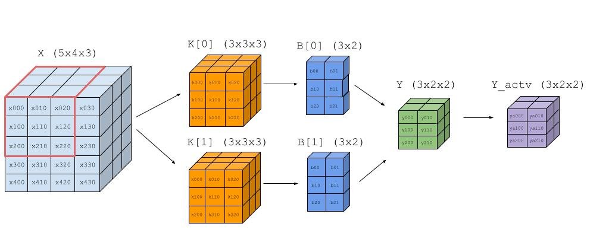
*Convolutional layer forwarding - input (5x4x4), 2 kernels (3x3x3), 2 biases (3x2), padding 0, stride 1*
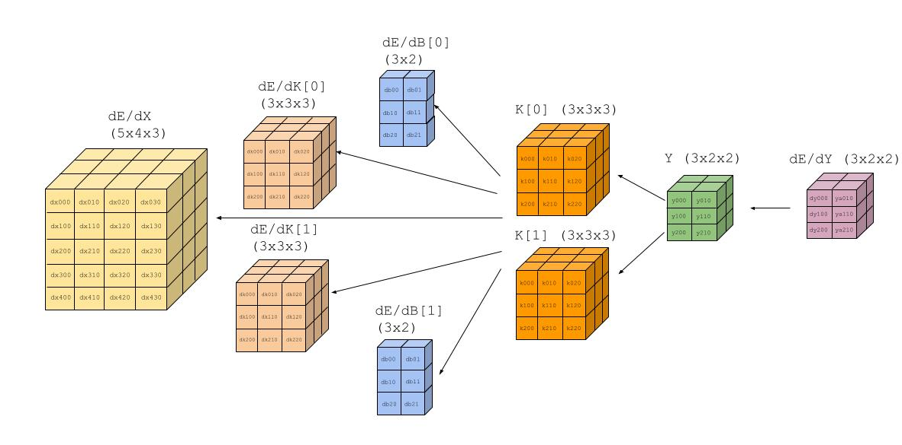
*Convolutional layer backpropagation*

## Dense layer
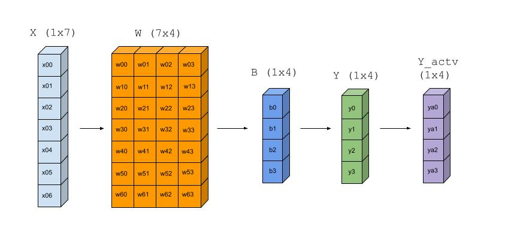
*Dense layer forwarding - input (1x7), weights (7x4), biases (1x4)*

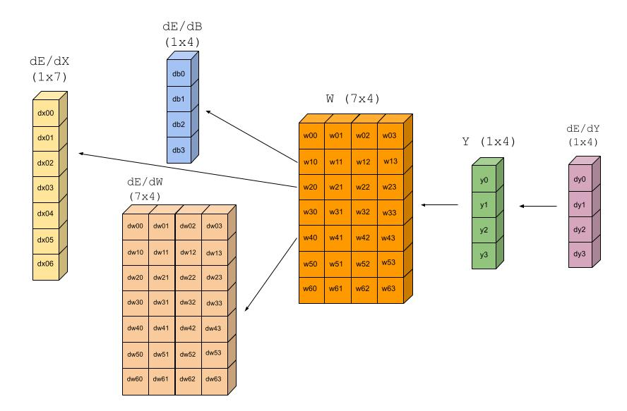
*Dense layer backpropagation*

## Pooling layer
### Average pooling layer
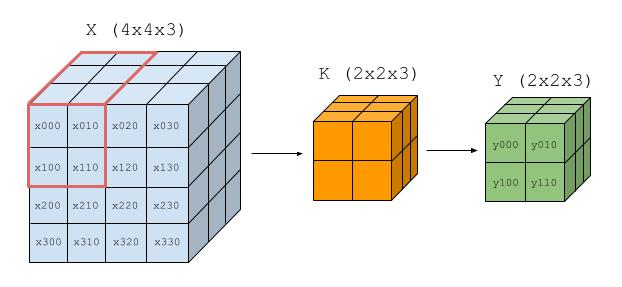
*Average pooling layer forwarding - input (4x4x3), kernel (2x2x3)*

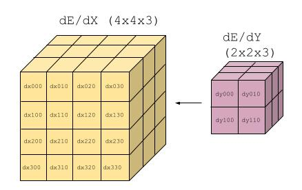
### Max pooling layer
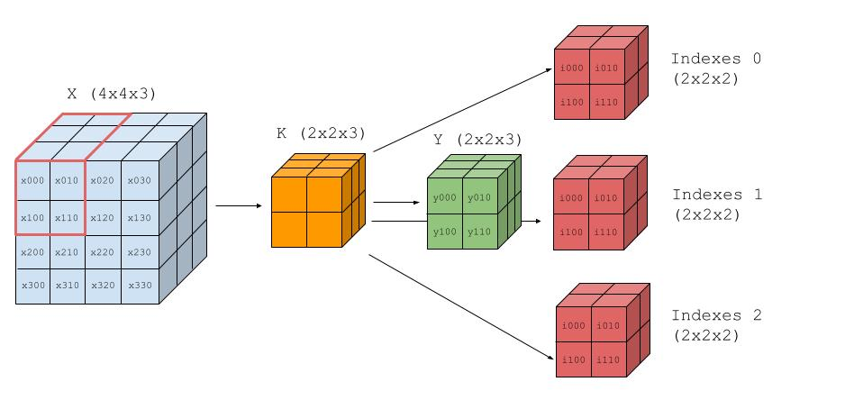
*Max pooling layer forwarding - input (4x4x3), kernel (2x2x3)*

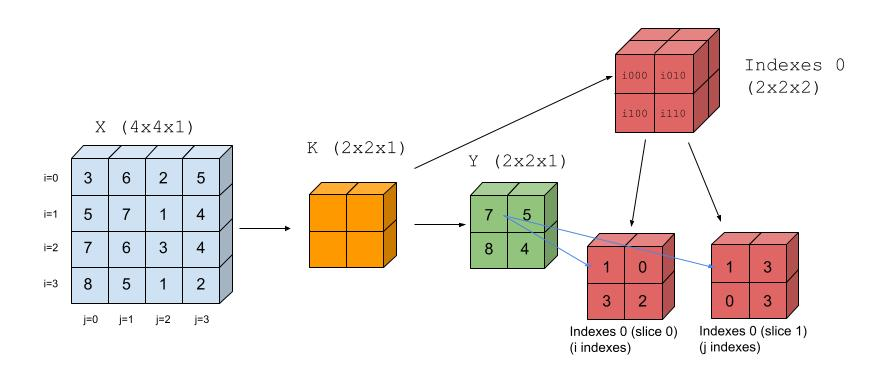
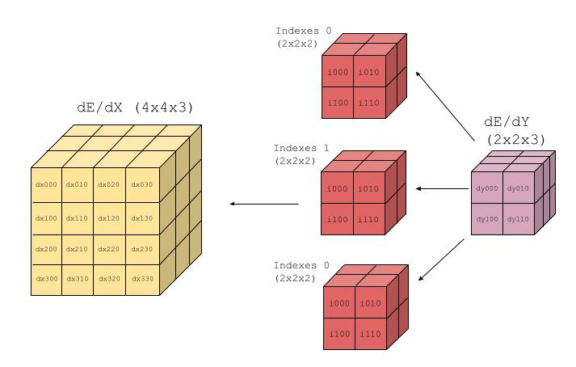
### Softmax layer
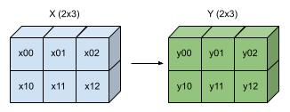
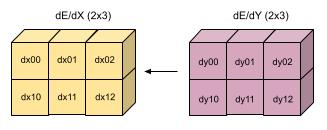
